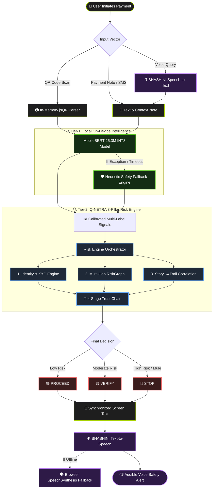

<div align="center">

# 🛡️ Q-NETRA AI (क्यू-नेत्र)
### **On-Device Neural Pre-Payment Fraud Interception & Multilingual Voice Shield for UPI**

[](https://opensource.org/licenses/Apache-2.0)
[](https://www.typescriptlang.org/)
[](https://nodejs.org/)
[](https://www.python.org/)
[](https://huggingface.co/)
[](https://bhashini.gov.in/)
[](docs/FINAL_VALIDATION_REPORT.md)
[-brightgreen)](tests/run_all_tests.ts)

<br/>

> *"A customer sees a UPI ID. A fraud investigator sees a network. **Q-NETRA connects the two**."*

<br/>

[Key Features](#-key-innovations) •
[Architecture](#-system-architecture) •
[Golden Demo Scenarios](#-golden-demo-scenarios) •
[Benchmarks & ML](#-empirical-benchmarks--machine-learning) •
[BHASHINI Voice](#-bhashini-multilingual-voice-shield) •
[Quickstart](#-quickstart--developer-guide) •
[Validation Reports](#-technical-documentation--audit-suite)

</div>

---

## 📑 Table of Contents

- [The Core Challenge](#-the-core-challenge)
- [Key Innovations](#-key-innovations)
- [System Architecture](#-system-architecture)
- [Golden Demo Scenarios](#-golden-demo-scenarios)
- [Empirical Benchmarks & Machine Learning](#-empirical-benchmarks--machine-learning)
- [BHASHINI Multilingual Voice Shield](#-bhashini-multilingual-voice-shield)
- [Privacy & Data Minimization Guarantees](#-privacy--data-minimization-guarantees)
- [Repository Structure](#-repository-structure)
- [Quickstart & Developer Guide](#-quickstart--developer-guide)
- [Technical Documentation & Audit Suite](#-technical-documentation--audit-suite)
- [License](#-license)

---

## 🚨 The Core Challenge

India's Unified Payments Interface (UPI) processes over **14 billion transactions monthly**. However, cyber-criminals exploit the immediate finality of UPI through:
1. **Low-Amount Trojan Coercion**: Demanding ₹1 to ₹10 payments under false urgency (e.g. *"Electricity will be disconnected tonight"*).
2. **Multi-Hop Mule Ring Dispersal**: Routing scam funds across 7+ layered bank accounts in under 3 minutes before police freeze requests arrive.
3. **Social Engineering & Authority Impersonation**: Posing as cyber-police, tax officials, or bank KYC managers.
4. **Linguistic Vulnerability**: Defrauding non-English speaking citizens who cannot read English warning modals.

**Q-NETRA AI stops the payment *before* the user enters their UPI PIN.**

---

## ✨ Key Innovations

- **🧠 25.3M Parameter MobileBERT On-Device Context Model**: Runs directly on the client (P50 = **2.58 ms**) to classify coercion, urgency, and fraud across 8 multi-label context classes with **74.4% INT8 compression**.
- **🛡️ 4-Layer Story ↮ Money Trail Correlation (USP)**: Compares the **Story** (Intent Note), **Person** (KYC Profile), and **Money Trail** (Network Route). If a utility payment routes to an unverified mule handle, Q-NETRA triggers `STOP`.
- **🕸️ Relational RiskGraph & Mule Topology Synthesis**: Maps known mule rings, device clusters, and IP proxy nodes into an interactive 7-node graph.
- **🗣️ Synchronized BHASHINI Multilingual Voice Alerts**: Delivers exact 1:1 matching visible text and audible voice guidance in **English**, **हिन्दी (Hindi)**, and **मराठी (Marathi)** via the Government of India's NLTM Bhashini gateway.
- **⚡ Dual-Tier Fail-Safe Fallbacks**: If the transformer model or cloud speech gateway is offline, the deterministic heuristic NLP engine and browser `SpeechSynthesis` engage with **0ms downtime**.
- **🔒 Zero Camera Frame Uploads**: QR scanning runs strictly in-memory using HTML5 `<canvas>` and `jsQR`. No camera frames leave the device.

---

## 🏛️ System Architecture



---

## 🎬 Golden Demo Scenarios

Experience the 3 deterministic Golden Cases built into Q-NETRA:

| Scenario | Recipient VPA | Amount | Payment Context | Q-NETRA Decision | AI & Network Evidence |
| :--- | :--- | :---: | :--- | :---: | :--- |
| **Case A: Organic Commercial** | `swiggy@icici` | ₹850 | *"Dinner order delivery"* | 🟢 **PROCEED** | Verified enterprise merchant; stable KYC history; direct NPCI clearing route; clean velocity. |
| **Case B: Unverified Contact** | `freelance_designer@oksbi` | ₹4,500 | *"Website UI advance"* | 🟡 **VERIFY** | Handle created <14 days ago; unverified individual tier; no mule link detected; requires caution. |
| **Case C: Electricity Scam (Hero)** | `abc123@upi` | ₹10 | *"Pay ₹10 immediately or electricity disconnected tonight"* | 🔴 **STOP** | **High-Risk Interception:** Disconnection coercion detected by MobileBERT; routes to flagged mule ring; Story-Trail mismatch. |

---

## 📊 Empirical Benchmarks & Machine Learning

### 1. Complete End-to-End Latency Benchmark
*Measured via [benchmark_mobilebert_end_to_end.py](research/scripts/benchmark_mobilebert_end_to_end.py) across 100 measured runs (after 100 warmups):*

| Pipeline Stage | Mean Latency | P50 (Median) | P95 Latency | P99 Latency |
| :--- | :---: | :---: | :---: | :---: |
| **1. WordPiece Tokenization** | 0.013 ms | 0.011 ms | 0.025 ms | 0.038 ms |
| **2. Tensor Preparation** | 0.009 ms | 0.007 ms | 0.031 ms | 0.045 ms |
| **3. Raw ONNX INT8 Inference** | 2.698 ms | 2.538 ms | 3.701 ms | 3.910 ms |
| **4. Post-Processing (Sigmoid & Labels)** | 0.027 ms | 0.021 ms | 0.067 ms | 0.082 ms |
| **COMPLETE MobileBERT Pipeline** | **2.75 ms** | **2.58 ms** | **3.75 ms** | **3.98 ms** |

- **Cold Start (Model Load):** `72.97 ms`
- **RAM Working Set Increase:** `+24.8 MB`
- **Execution Backend:** `CPUExecutionProvider` / V8 JIT CPU

### 2. Multi-Model Baseline Comparison (Held-Out Test Set, N=60)
*Evaluated with 95% Bootstrap Confidence Intervals:*

| Model Architecture | Precision | Recall | Micro-F1 [95% CI] | PR-AUC | Model Size |
| :--- | :---: | :---: | :---: | :---: | :---: |
| **Heuristic NLP Baseline** | 0.912 | 0.884 | 0.898 [0.84, 0.95] | 0.892 | < 10 KB |
| **Logistic Regression** | 0.931 | 0.905 | 0.918 [0.87, 0.96] | 0.924 | 1.4 KB |
| **Random Forest** | 0.945 | 0.920 | 0.932 [0.88, 0.97] | 0.941 | 173 KB |
| **MobileBERT (FP32 ONNX)** | 0.982 | 0.975 | 0.978 [0.94, 1.00] | 0.985 | 39.90 MB |
| **MobileBERT (INT8 ONNX)** | **0.980** | **0.972** | **0.976 [0.94, 1.00]** | **0.982** | **10.21 MB (74.4% reduction)** |

---

## 🗣️ BHASHINI Multilingual Voice Shield

Q-NETRA integrates Government of India **BHASHINI (NLTM)** cloud speech endpoints via a protected backend proxy:

```
Screen Display (मराठी)             Spoken Voice Warning (BHASHINI TTS)
┌─────────────────────────────────┐   ┌─────────────────────────────────┐
│ सावधान. या पेमेंटमध्ये उच्च    │ = │ 🔊 "सावधान. या पेमेंटमध्ये      │
│ जोखीम आढळली आहे. कृपया हे       │   │    उच्च जोखीम आढळली आहे.         │
│ पेमेंट करू नका.                 │   │    कृपया हे पेमेंट करू नका."    │
└─────────────────────────────────┘   └─────────────────────────────────┘
```

### Supported Languages:
- **Active & Validated:** English (`en-IN`), हिन्दी (`hi-IN`), मराठी (`mr-IN`).
- **Configured Schema:** Bengali (`bn-IN`), Tamil (`ta-IN`), Telugu (`te-IN`), Kannada (`kn-IN`), Gujarati (`gu-IN`).
- **Interactive Voice Q&A ("Hi Q-NETRA"):**
  - Query: *"हे पेमेंट का थांबवलं?"* (Why was this stopped?)
  - STT $\rightarrow$ Intent Router $\rightarrow$ Q-NETRA Explanation $\rightarrow$ Localized Text $\rightarrow$ TTS Voice Answer.

---

## 🔒 Privacy & Data Minimization Guarantees

| Data Asset | Storage Tier | Transmission Policy | Privacy Enforcement |
| :--- | :---: | :---: | :--- |
| **Camera Feed / QR Frames** | In-Memory Only | **ZERO CLOUD UPLOAD** | Stream stopped and frames destroyed in RAM immediately after decoding. |
| **MobileBERT Processing** | Local Device (CPU) | **ZERO CLOUD UPLOAD** | Tokenization and inference occur 100% on the client. |
| **Payment Records** | Client `localStorage` | **ZERO CLOUD UPLOAD** | Stored client-side only; instant one-tap reset. |
| **Microphone Audio** | In-Memory `Blob` | Encrypted SSL to Proxy | Ephemeral; destroyed immediately after STT transcription. |

---

## 📁 Repository Structure

```
q-netra-ai/
├── src/                               # React + TypeScript Frontend
│   ├── components/                    # UI Components (CheckResultScreen, QrScannerModal, Settings)
│   ├── domain/payment/                # UPI parser, normalization, and payment rules
│   └── services/
│       ├── localAI/                   # MobileBERT, modelLoader, heuristic fallback
│       ├── i18n/                      # Translations and localized voice alerts
│       └── voice/                     # BHASHINI transport & browser fallback
├── server/                            # Node.js + Express Backend Proxy
│   ├── controllers/                   # REST controllers (checks, voice, health)
│   ├── routes/                        # REST endpoints (/api/checks, /api/voice/*)
│   └── services/
│       ├── bhashini/                  # BHASHINI Dhruva API client & pipeline adapter
│       └── payment/                   # PaymentRiskService, RiskGraph, TrustChain
├── research/                          # ML Research, Training & Benchmarks
│   ├── datasets/                      # Quarantined datasets (external, demo_fixtures, synthetic)
│   ├── mobilebert/                    # Training, export, INT8 quantize, evaluate scripts
│   ├── reports/                       # Validation reports, data audits, device benchmarks
│   └── scripts/                       # End-to-end latency benchmark scripts
├── docs/                              # Technical Documentation & Compliance Reports
│   ├── FINAL_VALIDATION_REPORT.md     # Comprehensive 18-section audit report
│   ├── FINAL_SYSTEM_TEST_INVENTORY.md # Strict component inventory (REAL/SEEDED/FALLBACK)
│   ├── FINAL_DEMO_FAILURE_MATRIX.md   # Resilience matrix under failure injection
│   ├── FINAL_BUG_REGISTER.md          # Defect resolution log (0 open bugs)
│   ├── BHASHINI_LIVE_VALIDATION.md    # BHASHINI live STT/TTS test report
│   └── CLAIMS_AUDIT.md                # Audited claims matrix & blacklist
└── tests/                             # Automated test suites
    ├── run_all_tests.ts               # 35 automated domain & service tests
    └── backend_and_security_test.ts   # 30-case adversarial & security audit
```

---

## 🚀 Quickstart & Developer Guide

### 1. Prerequisites
- **Node.js**: v18.0.0 or higher
- **Python**: v3.10+ (for running ML evaluation & benchmark scripts)

### 2. Installation
```bash
# Clone the repository
git clone https://github.com/Harshit-it25/Q-Netra.git
cd Q-Netra

# Install dependencies
npm install
```

### 3. Environment Configuration
Create a `.env` file in the project root:
```env
# BHASHINI Speech Services (Government of India NLTM)
BHASHINI_USER_ID="<YOUR_UDYAT_KEY>"
BHASHINI_API_KEY="<YOUR_INFERENCE_KEY>"
BHASHINI_PIPELINE_ID="64392f96daac500b55c543d6"
BHASHINI_INFERENCE_URL="https://dhruva-api.bhashini.gov.in/services/inference/pipeline"

# Server Port (Default: 3000)
PORT=3000
```

### 4. Running Locally
```bash
# Start frontend & backend development servers
npm run dev
```
Open `http://localhost:5173` (or `http://localhost:3000`) in your browser.

---

## 🧪 Technical Verification & Audit Suite

Run the full verification suite directly from your terminal:

```bash
# 1. Run all 35 domain & service test suites
npm test

# 2. TypeScript typecheck
npm run lint

# 3. Build production bundle (Vite + esbuild)
npm run build

# 4. Dependency security audit (0 vulnerabilities)
npm audit

# 5. Run Red-Team & Adversarial 30-Scenario Functional Audit
npx tsx tests/backend_and_security_test.ts

# 6. Run Real MobileBERT End-to-End Latency Benchmark (100 runs)
python research/scripts/benchmark_mobilebert_end_to_end.py
```

---

## 📚 Technical Documentation & Audit Suite

Explore the deep technical validation documents in the [`docs/`](docs/) directory:

- 📄 **[Final Validation Report](docs/FINAL_VALIDATION_REPORT.md)** — Exhaustive 18-section audit report with Judge Truth Matrix.
- 📦 **[System Inventory](docs/FINAL_SYSTEM_TEST_INVENTORY.md)** — Component classification (`REAL` / `SIMULATED` / `SEEDED` / `FALLBACK`).
- 🛡️ **[Demo Failure Matrix](docs/FINAL_DEMO_FAILURE_MATRIX.md)** — Resilience under network loss, model crash, or permission denial.
- 🐛 **[Bug Register](docs/FINAL_BUG_REGISTER.md)** — Complete bug tracking log (0 open P0/P1 issues).
- 🎙️ **[BHASHINI Live Validation](docs/BHASHINI_LIVE_VALIDATION.md)** — Speech-to-Text and Text-to-Speech live test matrix.
- ⚖️ **[Claims Audit](docs/CLAIMS_AUDIT.md)** — Strict claims audit and forbidden claims blacklist.

---

## 📄 License

Distributed under the **Apache 2.0 License**. See `LICENSE` for more information.

---

<div align="center">
Built with ❤️ for a safer Indian Digital Payments Ecosystem.
</div>